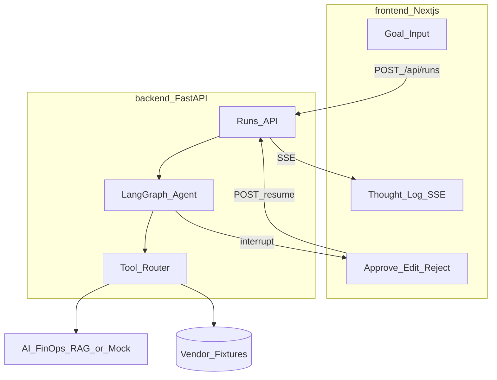

# AI-Procurement-Agent

Portfolio sample: a **LangGraph ReAct agent** that runs a vendor procurement workflow — search vendors, check historical FinOps prices, review contract/PO drift, draft a negotiation email — then **pauses for human approval**.

| Layer | Role |
| --- | --- |
| **Frontend** | Next.js — goal input, live Thought/Action/Observation log, Approve / Edit / Reject |
| **Backend** | FastAPI — run/resume agent, SSE traces, tool orchestration |
| **Agent** | LangGraph stateful graph (search → FinOps → compare → review/draft → HITL) |
| **LLM** | Env switch: Ollama / OpenAI / Anthropic / mock |
| **Tools** | `search_vendors`, `query_finops_rag`, `review_invoice`, `draft_email` (+ mock FinOps fallback) |

Sits on top of [AI-FinOps-RAG](https://github.com/kondotakuya65/AI-FinOps-RAG) as an external tool API (optional live; mock works offline).

**Docs:** [Scenario](docs/01-scenario.md) · [Architecture](docs/02-architecture.md) · [Implementation plan](docs/03-implementation-plan.md) · [Design decisions](docs/04-design-decisions.md) · [Docs index](docs/README.md)

---

## Architecture



**Design rule:** the LLM plans and explains; **tools** fetch prices and drafts; **humans** approve before anything is “sent” (outbox only in MVP).

---

## Stack

| Concern | Choice |
| --- | --- |
| Agent | LangGraph (ReAct + typed state + HITL interrupt) |
| Backend | FastAPI, Pydantic Settings |
| Frontend | Next.js App Router, TypeScript |
| LLM | `LLM_PROVIDER=ollama\|openai\|anthropic\|mock` |
| Streaming | SSE for thought traces (WebSocket stretch) |
| FinOps | HTTP client → FinOps-RAG, with offline mock |
| Eval | pytest golden runs + CI |

---

## Repo layout

```
/
├── backend/app/
│   ├── api/           health, runs, resume, stream
│   ├── agent/         LangGraph graph, state, nodes
│   ├── tools/         search_vendors, finops, draft_email
│   ├── llm/           provider adapter
│   └── db/            run persistence (sqlite | postgres)
├── frontend/          Next.js workspace
├── fixtures/          vendors/, finops_mock/, scenarios/
├── docs/
├── docker-compose.yml
└── .env.example
```

---

## Quick start

```bash
cp .env.example .env

# Backend (port 8100)
cd backend
python -m venv .venv
# Windows: .venv\Scripts\Activate.ps1
pip install -r requirements.txt
uvicorn app.main:app --reload --port 8100
```

- API docs: http://localhost:8100/docs  
- Health: http://localhost:8100/api/health  

```bash
# Frontend (port 3001 — FinOps UI stays on :3000)
cd frontend
cp .env.local.example .env.local
npm install
npm run dev
```

Open http://localhost:3001. LangGraph tools / HITL land in later phases (see roadmap).

```bash
# Optional: docker compose (API :8100, UI :3001, Postgres host :5433)
cp .env.example .env
docker compose up --build
```

---

## Roadmap (detailed)

### Phase A — Foundation
1. Scaffold: README, docs, env, FastAPI health, Next shell, compose  
2. Vendor catalog, mock FinOps history, golden scenarios  
3. **Done (this commit):** LLM adapter (`ollama` / `openai` / `anthropic` / `mock`)

### Phase B — Tools
4. Tool contracts / `ToolResult` shapes  
5. `search_vendors` (fixture catalog)  
6. FinOps HTTP client + mock fallback (`query_finops_rag`, `review_invoice`)  
7. **Done (this commit):** `draft_email` tool

### Phase C — LangGraph
8. Typed state + graph skeleton  
9. Happy-path workflow (search → history → compare → draft → summary)  
10. Reflection / re-plan (zero vendors → similar SKUs; tool retry)  
11. **Done (this commit):** HITL interrupt before final email

### Phase D — API + streaming
12. `POST /api/runs` + resume endpoints  
13. **Done (this commit):** SSE thought / action / observation stream

### Phase E — UI
14. Workspace: goal input, live step log, state panel  
15. **Done (this commit):** HITL panel: draft preview + Approve / Edit / Reject  

MVP ship line: through **E2** (HITL UI).  

### Phase F — Quality + stretch
16. Golden eval + CI  
17. Stretch: email reflection loop (writer → reviewer)  
18. Stretch: optional live vendor search flag; compose with live FinOps  

---

## Portfolio trilogy + agent layer

1. [AI-Code-Reviewer-Sample](https://github.com/kondotakuya65/AI-Code-Reviewer-Sample)  
2. [AI-Resume-Reviewer](https://github.com/kondotakuya65/AI-Resume-Reviewer)  
3. [AI-FinOps-RAG](https://github.com/kondotakuya65/AI-FinOps-RAG)  
4. **AI-Procurement-Agent** (this repo)

---

## License

MIT
